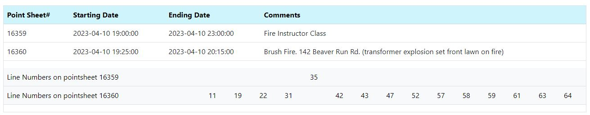

# Point Sheet Overlap
The Point Sheet Overlap section contains two programs:
1. pointsheet_overlap_search.php: this will determine if there are two or more point sheets that overlap based on starting and ending dates/times, and;
2. pointsheet_overlap.php: this contains HTML and CSS to display the results in a tabular format.

## pointsheet_overlap_search.php
This program will connect to the mySQL databse and read point sheet headers and details. If any point sheets' starting and ending dates overlap, some basic point sheet header information and point sheet detail's line numbers will be added to an array. At least one of the point sheets must be a department-level point sheet (e.g., fire, drill, etc.). 

## pointsheet_overlap.php
This program will instantiate an instance a class of the pointsheet_overlap_search program. It will then read the array that was created from that program.

## Output and program's array format
The following is an example of two point sheets that overlap. Based on the output, line number 35 was not given credit for the brush fire while he/she was at fire school. The partial screen cap is:

The following is the multi-dimensional array. The elements containing point sheet information are sets of both an associative array (incrementing the key by one) and distributive arrays containing line numbers, while the merged_linenumbers is a key for the associative array that contains a distributive array of line numbers.

Line breaks were added for readability:

array(3) {

[0]=> array(6) { ["Pointsheet_number"]=> string(5) "16359" ["starting_date"]=> string(19) "2023-04-10 19:00:00" ["ending_date"]=> string(19) "2023-04-10 23:00:00" ["comments"]=> string(21) "Fire Instructor Class" ["dept_flag"]=> string(1) "0" ["line_numbers"]=> array(1) { [0]=> string(2) "35" } }

[1]=> array(6) { ["Pointsheet_number"]=> string(5) "16360" ["starting_date"]=> string(19) "2023-04-10 19:25:00" ["ending_date"]=> string(19) "2023-04-10 20:15:00" ["comments"]=> string(80) "Brush Fire. 142 Beaver Run Rd. (transformer explosion set front lawn on fire)" ["dept_flag"]=> string(1) "1" ["line_numbers"]=> array(14) { [0]=> string(2) "11" [1]=> string(2) "19" [2]=> string(2) "22" [3]=> string(2) "31" [4]=> string(2) "42" [5]=> string(2) "43" [6]=> string(2) "47" [7]=> string(2) "52" [8]=> string(2) "57" [9]=> string(2) "58" [10]=> string(2) "59" [11]=> string(2) "61" [12]=> string(2) "63" [13]=> string(2) "64" } }

["merged_linenumbers"]=> array(15) { [0]=> string(2) "11" [1]=> string(2) "19" [2]=> string(2) "22" [3]=> string(2) "31" [4]=> string(2) "35" [5]=> string(2) "42" [6]=> string(2) "43" [7]=> string(2) "47" [8]=> string(2) "52" [9]=> string(2) "57" [10]=> string(2) "58" [11]=> string(2) "59" [12]=> string(2) "61" [13]=> string(2) "63" [14]=> string(2) "64" } }

Using json_encode, the array would look like this:

{

  "0": {
    "Pointsheet_number": "16359",
    "starting_date": "2023-04-10 19:00:00",
    "ending_date": "2023-04-10 23:00:00",
    "comments": "Fire Instructor Class",
    "dept_flag": "0",
    "line_numbers": [
      "35"
    ]
  },

  "1": {
    "Pointsheet_number": "16360",
    "starting_date": "2023-04-10 19:25:00",
    "ending_date": "2023-04-10 20:15:00",
    "comments": "Brush Fire. 142 Beaver Run Rd. (transformer explosion set front lawn on fire)",
    "dept_flag": "1",
    "line_numbers": [
      "11",
      "19",
      "22",
      "31",
      "42",
      "43",
      "47",
      "52",
      "57",
      "58",
      "59",
      "61",
      "63",
      "64"
    ]
  },

  "merged_linenumbers": [
    "11",
    "19",
    "22",
    "31",
    "35",
    "42",
    "43",
    "47",
    "52",
    "57",
    "58",
    "59",
    "61",
    "63",
    "64"
  ]
}